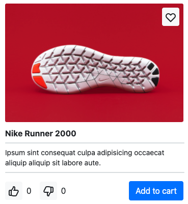

`#react.js` `#master-in-software-engineering`

<!-- ALL-CONTRIBUTORS-BADGE:START - Do not remove or modify this section -->

[](#contributors-)

<!-- ALL-CONTRIBUTORS-BADGE:END -->

# Assembler School: React Shopping Cart Components

In this project you will learn how to create a React.js and how to apply all the
important concepts.

## Getting Started

These instructions will get you a copy of the project up and running on your
local machine for development and testing purposes.

See deployment for notes on how to deploy the project on a live system.

### The repository

First, you will need to `clone` or `fork` the repository into your Github
account:


```
$ git clone https://github.com/assembler-school/react-shopping-cart-components.git
```

## Contents and Branches Naming Strategy

The repository is made up of several branches that include the contents of each
section.

The branches follow a naming strategy like the following:

- `main`: includes the main contents and the instructions
- `assembler-solution`: includes the solution

### Fetching All the Branches

In order to fetch all the remote branches in the repository, you can use the
following command:

```sh
$ git fetch --all
```

### List Both Remote Tracking Branches and Local Branches

```sh
$ git branch --all
```

Then, you can create a local branch based on a remote branch with the following
command:

```sh
$ git checkout -b <new_branch_name> <remote_branch_name>
```

### Installing

First, you will need to install the dependencies with: `npm install`.

Run the following command in your terminal after cloning the main repo:

```sh
$ npm install
```

### Running the Tests

The tests that validate your solution can be executed by runing the following
command:

```
$ npm run test
```

### Git `precommit` and `prepush` Hooks

In the `assembler-solution` branch you can see an implementation of these tools
if you'd like to use them.

## Deployment

In this pill we won't deploy the app.

## Technologies used

- `React.js`
- `@testing-library/react`
- `eslint`
- `prettier`
- `lint-staged`
- `husky`

## Project requirements

This is an overview of the main requirements of this project.

- You must follow all the instructions of the project step-by-step
- You should always try to solve them by yourself before asking for help
- You should always help your team members and fellow students of the master so
  that you can all learn together and become better software developers and team
  members
- You must finish all the steps that are marked as `Required`
- You must use semantic HTML5 elements for all the markup of the application
- Once you are done, you can move on to the optional ones that are marked as
  `Extra 💯`

### 1. Main component

#### File

```sh
/src/components/Main
```

In this step you will need to finish the code with the following requirements:

1. return a `<main>` html5 element that renders the `{children}` prop it
   receives
2. receive all the other `...props` and forward them to the `<main>` element
3. export the component from an `index.js` file. you should export the default
   component if is the only one

#### Test suite name

The following test suite validates that everything is correct: `<Main />`.

### 2. Button component

#### File

```sh
/src/components/Button
```

In this step you will need to finish the code with the following requirements:

1. return a `<button>` html5 element instead of the `div`
2. include all the previous props that the `div` element had
3. receive a `disabled` prop that has a default value of `false` that is
   assigned to the `<button>` element
4. receive all the other `...props` and forward them to the `<button>` element

#### Test suite name

The following test suite validates that everything is correct: `<Button />`.

### 3. App component

#### File

```sh
/src/App.js
```

In this step you will need to finish the code with the following requirements:

1. render the `<Home />` component from the `pages` folder

#### Test suite name

This step doesn't have any tests.

### 4. Home component

#### File

```sh
/src/pages/Home
```

In this step you will need to finish the code with the following requirements:

1.  uncomment all the code
2.  render the `<ProductsListing />` component and pass the following props:
    1. `products={...}`
    2. `handleDownVote={...}`
    3. `handleUpVote={...}`
    4. `handleSetFavorite={...}`
    5. `handleAddToCart={...}`

#### Test suite name

The following test suite validates that everything is correct: `<Home />`.

### 5. ItemCard component

#### File

```sh
/src/components/ItemCard
```

In this step you will need to finish the code with the following requirements:

1. uncomment all the code
2. destructure the following props in the component:
   1. `id`
   2. `img`
   3. `title`
   4. `shortDescription`
   5. `isFavorite`
   6. `upVotes`
   7. `downVotes`
   8. `handleDownVote`
   9. `handleUpVote`
   10. `handleSetFavorite`
   11. `handleAddToCart`
3. add the styles in the `ItemCard.scss` file so that it matches visually the
   screenshot bellow
4. render the `img` prop inside an `img` element
5. render the `FavoriteIconButton` component and pass it the following props:
   1. `handleSetFavorite={onSetFavorite}`
   2. `isFavorite=...`
6. render the `title` prop inside an `h2` element
7. render the `shortDescription` prop inside a `p` element
8. render a `IconButton` component and pass in the following props:
   1. `aria-label="up vote product"`
   2. `handleClick={onUpVote}`
   3. children: `<ThumbDown />` component
   4. bellow it a `p` element with the `textContent` of the
      `downVotes.currentValue` prop
9. render a `IconButton` component and pass in the following props:
   1. `aria-label="down vote product"`
   2. `handleClick={onDownVote}`
   3. children: `<ThumbUp />` component
   4. bellow it a `p` element with the `textContent` of the
      `upVotes.currentValue` prop
10. A `<Button>` component that has the following prop:
    1. `onClick={onAddToCart}`
    2. and a text of `Add to cart`
11. default export the component in the `index.js` file

#### ItemCard Screenshot



#### Test suite name

The following test suite validates that everything is correct: `<ItemCard />`.

### 6. ProductsListing component

#### File

```sh
/src/components/ProductsListing
```

In this step you will need to finish the code with the following requirements:

1. uncomment all the code
2. destructure the following props in the component:
   1. `products`
   2. `handleDownVote`
   3. `handleUpVote`
   4. `handleSetFavorite`
   5. `handleAddToCart`
   6. `...props`
3. render the `ItemCard` component using `[].map()` and pass in the following
   props:
   1. `key={product.id}`
   2. `id={product.id}`
   3. `img={product.img}`
   4. `title={product.title}`
   5. `shortDescription={product.shortDescription}`
   6. `upVotes={product.votes.upVotes}`
   7. `handleUpVote={handleUpVote}`
   8. `downVotes={product.votes.downVotes}`
   9. `handleDownVote={handleDownVote}`
   10. `isFavorite={product.isFavorite}`
   11. `handleSetFavorite={handleSetFavorite}`
   12. `handleAddToCart={handleAddToCart}`
4. default export the component in the `index.js` file

#### Test suite name

The following test suite validates that everything is correct:
`<ProductsListing />`.

## Project delivery

To deliver this project you must follow the steps indicated in the document:

- [Submitting a solution](https://www.notion.so/Submitting-a-solution-524dab1a71dd4b96903f26385e24cdb6)

## Resources

- [react-testing-library](https://testing-library.com/docs/react-testing-library/intro/)
- [reactjs.org](https://reactjs.org/)

## License

This project is licensed under the MIT License - see the [LICENSE](LICENSE) file
for details

## Contributors ✨

Thanks goes to these wonderful people
([emoji key](https://allcontributors.org/docs/en/emoji-key)):

<!-- ALL-CONTRIBUTORS-LIST:START - Do not remove or modify this section -->
<!-- prettier-ignore-start -->
<!-- markdownlint-disable -->
<table>
  <tr>
    <td align="center"><a href="http://www.danilucaci.com"><br /><sub><b>Dani Lucaci</b></sub></a><br /><a href="https://github.com/assembler-school/vanilla-js-project-template/commits?author=danilucaci" title="Code">💻</a> <a href="https://github.com/assembler-school/vanilla-js-project-template/commits?author=danilucaci" title="Documentation">📖</a> <a href="#example-danilucaci" title="Examples">💡</a> <a href="#tool-danilucaci" title="Tools">🔧</a></td>
  </tr>
</table>

<!-- markdownlint-restore -->
<!-- prettier-ignore-end -->

<!-- ALL-CONTRIBUTORS-LIST:END -->

This project follows the
[all-contributors](https://github.com/all-contributors/all-contributors)
specification. Contributions of any kind welcome!
